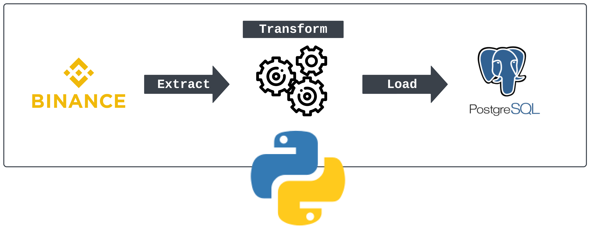

# Monitoramento de Preços do Bitcoin

Uma aplicação baseada em Python que monitora o preço do Bitcoin em tempo real usando a API pública da Binance. O sistema armazena os dados de preço em um banco de dados PostgreSQL para uma gestão e análise robusta de dados.  



## 🚀 Funcionalidades

- Monitoramento em tempo real do preço do Bitcoin via API da Binance  
- Armazenamento de dados em nível empresarial com PostgreSQL  
- Intervalos de monitoramento configuráveis  
- Arquitetura de dados escalável  
- Configuração baseada em ambiente  

## 📋 Pré-requisitos

- Python 3.8+
- Servidor PostgreSQL  
- Pacotes necessários: 
  - `requests`
  - `sqlalchemy`
  - `psycopg2-binary`
  - `python-dotenv`

## 🛠️ Instalação

1. **Clone o repositório**
```bash
git clone https://github.com/nathanfrib/proj_bitcoin_postgrees.git
cd proj_bitcoin_postgrees
```

2. **Configure o ambiente virtual**
```bash
python -m venv .venv
source .venv/bin/activate  # Linux/Mac
# or
.venv\Scripts\activate     # Windows
```

3. **Instale as dependências**
```bash
pip install -r requirements.txt
```

4. **Configure as variáveis de ambiente**

Crie um arquivo `.env` na raiz do projeto com as seguintes variáveis:

```env
POSTGRES_USER=your_username
POSTGRES_PASSWORD=your_password
POSTGRES_HOST=localhost
POSTGRES_PORT=5432
POSTGRES_DB=bitcoin_db
```

## 💻 Como Usar

1. *Certifique-se de que o PostgreSQL está em execução*

2. **Inicie o sistema de monitoramento**
```bash
python main.py
```


O aplicativo fará:
- Criar as tabelas necessárias no banco de dados, se elas não existirem
- Buscar os preços do Bitcoin em intervalos regulares
- Armazenar os dados no banco de dados PostgreSQL
- Permitir o monitoramento em tempo real do preço

## 📁 Estrutura do Projeto

```
proj_bitcoin/
├── main.py          # Script principal da aplicação
├── database.py      # Modelos e configuração do banco de dados
├── .env            # Variáveis de ambiente (não rastreadas no git)

├── requirements.txt # Python dependencies
└── README.md       # Project documentation
```

## 📚 Dependências

- `requests`: Requisições HTTP para a API da Binance
- `sqlalchemy`: ORM para o banco de dados
- `psycopg2-binary`: Adaptador para o PostgreSQL
- `python-dotenv`: Gerenciamento de variáveis de ambiente


## 🔧 Esquema do Banco de Dados

```sql
Table: bitcoin_prices
- timestamp (TIMESTAMP)
- symbol (VARCHAR)
- price (NUMERIC)
```

## 🔜 Melhorias Futuras

- [ ] Suporte para múltiplas criptomoedas
- [ ] Interface web em tempo real
- [ ] Painel de análise avançada
- [ ] Ferramentas de visualização de dados
- [ ] API endpoint para acesso aos dados

## 🚨 Soluções para Problemas Comuns
- Erros de conexão com o banco de dados: Verifique o status do serviço PostgreSQL e as credenciais
- Limites de taxa da API: Verifique as configurações de frequência de requisições
- Falhas na inserção de dados: Certifique-se de que as permissões do banco de dados estão corretas


## 🤝 Contributing

1. Faça um fork do repositório
2. Crie sua branch de funcionalidade (`git checkout -b feature/NovaFuncionalidade`)
3. Faça commit das suas alterações (`git commit -m 'Adicionando nova funcionalidade'`)
4. Faça push para a branch (`git push origin feature/NovaFuncionalidade`)
5. Abra um Pull Request

## ✨ Suporte

Se você achar este projeto útil, por favor, dê uma estrela!

---
